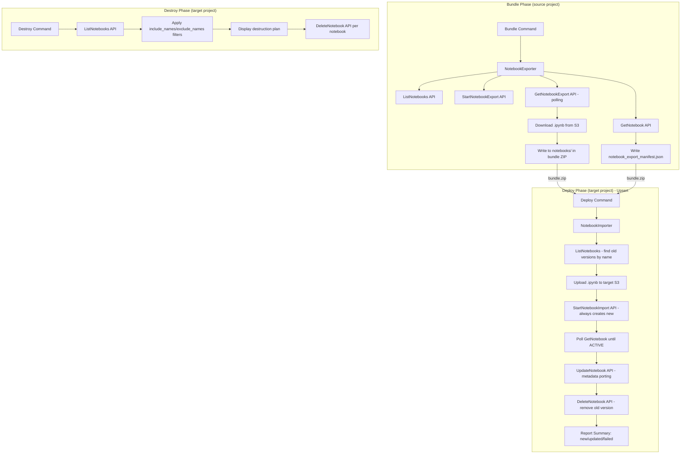

# Design Document: Data Notebooks Support

## Overview

This feature adds native Data Notebooks support to the SMUS CI/CD CLI, enabling promotion of SageMaker Unified Studio notebooks across environments (dev → test → prod) using the DataZone Notebook Import/Export APIs. The implementation follows the existing CLI architecture patterns — specifically mirroring the catalog import/export approach — with two new helper modules (`notebook_export.py` and `notebook_import.py`) and integration into the existing `bundle`, `deploy`, `destroy`, and `dry-run` commands.

### Design Goals

- **Consistency**: Follow the same module structure, error handling, and reporting patterns established by the catalog import/export feature
- **Resilience**: Individual notebook failures do not block the entire export/import operation; failures are collected and reported
- **Upsert Safety**: Import uses a create-or-replace strategy — old versions are only deleted after the new version is confirmed ACTIVE and updated
- **Idempotency**: Import operations use client tokens to prevent duplicate notebook creation on retries
- **Extensibility**: The `content.notebooks` manifest section and `deployment_configuration.notebooks` section follow the same convention as `content.catalog` and `deployment_configuration.catalog`

### Key Design Decisions

1. **Separate helper modules** rather than embedding logic in command files — follows `catalog_export.py` / `catalog_import.py` pattern
2. **JSON manifest inside the bundle** (`notebooks/notebook_export_manifest.json`) — mirrors `catalog/catalog_export.json` approach
3. **Async polling with exponential backoff** for both export (GetNotebookExport) and post-import status (GetNotebook) — avoids hammering APIs
4. **Notebook ID used directly for file paths** — the notebook ID (pattern: `[a-zA-Z0-9_-]{1,36}`) is inherently safe for both filesystem and S3 key usage, eliminating the need for name sanitization
5. **Add `notebook` resource type** to the existing `DEPLOY_RESOURCE_TYPES` / `DESTROY_SUPPORTED_RESOURCE_TYPES` registries for destroy support
6. **Upsert strategy (create-or-replace)** — StartNotebookImport always creates a new notebook (duplicate names allowed), then old version with same name is deleted only after new one is ACTIVE + metadata-updated. This ensures zero data loss.
7. **Name-only filtering** — `include_names` and `exclude_names` match by notebook name only (case-sensitive exact match), no ID matching

---

## Architecture

### High-Level Data Flow



### Module Placement

```
src/smus_cicd/
├── helpers/
│   ├── notebook_export.py          # NEW: Notebook export logic for bundle
│   ├── notebook_import.py          # NEW: Notebook import logic for deploy
│   └── ...
├── commands/
│   ├── bundle.py                   # MODIFIED: call notebook_export when enabled
│   ├── deploy.py                   # MODIFIED: call notebook_import after catalog
│   ├── destroy.py                  # MODIFIED: (via destroy_validator/executor)
│   └── dry_run/
│       └── checkers/
│           └── notebook_checker.py # NEW: Dry-run validation for notebooks
├── application/
│   └── application_manifest.py     # MODIFIED: add NotebookConfig dataclass
└── resource_types.py               # MODIFIED: add "notebook" resource type
```

### Integration Points

| Command | Integration Point | Action |
|---------|-------------------|--------|
| `bundle` | After catalog export | Call `export_notebooks()` if `content.notebooks.enabled` |
| `deploy` | After catalog import, before bootstrap | Call `import_notebooks()` if manifest present |
| `destroy` | Validation phase | Call `ListNotebooks` to discover notebooks, apply `include_names`/`exclude_names` filters |
| `destroy` | Execution phase | Call `DeleteNotebook` for each filtered notebook |
| `dry-run` | After catalog checker | `NotebookChecker.check()` validates prerequisites |

---

## Components and Interfaces

### 1. Manifest Configuration (`application_manifest.py`)

New dataclass for the `content.notebooks` section:

```python
@dataclass
class NotebookConfig:
    """Notebook export configuration for bundle."""
    enabled: bool = False
    include_names: Optional[List[str]] = None  # notebook names only (case-sensitive exact match)
    exclude_names: Optional[List[str]] = None  # notebook names only (case-sensitive exact match)
```

**Parsing**: Added to `ContentConfig`:

```python
@dataclass
class ContentConfig:
    storage: List[StorageConfig] = field(default_factory=list)
    git: List[GitContentConfig] = field(default_factory=list)
    catalog: Optional[CatalogConfig] = None
    notebooks: Optional[NotebookConfig] = None  # NEW
    quicksight: List[QuickSightDashboardConfig] = field(default_factory=list)
    workflows: List[Dict[str, Any]] = field(default_factory=list)
```

**Deployment configuration** (per-stage disable):

```python
@dataclass
class DeploymentConfiguration:
    storage: List[StorageConfig] = field(default_factory=list)
    git: List[GitTargetConfig] = field(default_factory=list)
    catalog: Optional[Dict[str, Any]] = None
    notebooks: Optional[Dict[str, Any]] = None  # NEW: {"disable": bool}
    quicksight: Optional[Dict[str, Any]] = None
```

### 2. NotebookExporter (`helpers/notebook_export.py`)

```python
def export_notebooks(
    domain_id: str,
    project_id: str,
    region: str,
    include_names: Optional[List[str]] = None,
    exclude_names: Optional[List[str]] = None,
    polling_timeout: int = 300,
) -> Tuple[List[ExportedNotebook], NotebookExportManifest]:
    """
    Export notebooks from a DataZone project.

    Args:
        domain_id: DataZone domain identifier
        project_id: DataZone project identifier
        region: AWS region
        include_names: Optional list of notebook names to include (case-sensitive exact match)
        exclude_names: Optional list of notebook names to exclude (case-sensitive exact match)
        polling_timeout: Max seconds to wait per notebook export (default 300)

    Returns:
        Tuple of (list of exported notebook file contents, manifest object)

    Raises:
        Exception: If ListNotebooks API fails entirely
    """
```

**Internal functions:**

```python
def _list_all_notebooks(client, domain_id: str, project_id: str) -> List[Dict]:
    """List all active notebooks with pagination."""

def _apply_filters(
    notebooks: List[Dict],
    include_names: Optional[List[str]],
    exclude_names: Optional[List[str]],
) -> List[Dict]:
    """Apply include_names/exclude_names filters by notebook name only.
    Include first, then exclude. Case-sensitive exact match."""

def _matches_name_filter(notebook: Dict, filter_names: List[str]) -> bool:
    """Check if notebook name matches any entry in the filter list (case-sensitive exact match)."""

def _export_single_notebook(
    client, s3_client, domain_id: str, project_id: str,
    notebook: Dict, polling_timeout: int,
) -> Optional[ExportedNotebook]:
    """Export a single notebook, poll for completion, download file."""

def _poll_export_status(
    client, domain_id: str, export_id: str, notebook_id: str,
    polling_timeout: int,
) -> Optional[str]:
    """Poll GetNotebookExport with exponential backoff. Returns S3 URI or None."""

def _build_export_manifest(
    exported: List[ExportedNotebook],
    domain_id: str,
    project_id: str,
) -> Dict[str, Any]:
    """Build the notebook_export_manifest.json structure."""

def _warn_duplicate_names(notebooks: List[Dict]) -> None:
    """Raise error if any duplicate notebook names in the filtered set.
    This enforces unique names to ensure reliable upsert behavior."""
```

### 3. NotebookImporter (`helpers/notebook_import.py`)

```python
def import_notebooks(
    domain_id: str,
    project_id: str,
    region: str,
    manifest_data: Dict[str, Any],
    notebook_files: Dict[str, bytes],
    s3_uri: str,
) -> NotebookImportSummary:
    """
    Import notebooks into a target DataZone project using upsert strategy.

    Upsert flow per notebook:
    1. ListNotebooks on target to find existing notebook(s) with same name ("old versions")
    2. Upload .ipynb to S3
    3. StartNotebookImport (always creates new notebook; duplicate names allowed)
    4. Poll GetNotebook until ACTIVE
    5. UpdateNotebook (port metadata from manifest)
    6. Delete old version(s) via DeleteNotebook (only after new is ACTIVE + updated)

    Args:
        domain_id: Target domain identifier
        project_id: Target project identifier
        region: AWS region
        manifest_data: Parsed notebook_export_manifest.json
        notebook_files: Dict mapping filePath -> file content bytes
        s3_uri: Target S3 URI from default.s3_shared connection

    Returns:
        NotebookImportSummary with counts (new, updated, failed)

    Raises:
        ValidationError: If manifest structure is invalid
        ConnectionError: If S3 connection is missing/invalid
    """
```

**Internal functions:**

```python
def _validate_notebook_manifest(manifest_data: Dict[str, Any]) -> None:
    """Validate manifest has required metadata and notebooks keys."""

def _list_existing_notebooks_by_name(
    client, domain_id: str, project_id: str,
) -> Dict[str, List[str]]:
    """List all ACTIVE notebooks in target project, return dict mapping
    name -> list of notebook IDs. Used for old version detection."""

def _find_old_versions(
    existing_by_name: Dict[str, List[str]], notebook_name: str,
) -> List[str]:
    """Return list of existing notebook IDs with the same name (old versions to delete)."""

def _upload_notebook_to_s3(
    s3_client, s3_uri: str, source_notebook_id: str, content: bytes,
) -> str:
    """Upload .ipynb file to S3 using notebook ID as the key and return the full S3 URI.
    Overwrites any existing file at the same key (safe for re-deploys)."""

def _generate_client_token(notebook_name: str, timestamp: str) -> str:
    """Generate deterministic idempotent client token, max 64 chars."""

def _import_single_notebook(
    client, s3_client, domain_id: str, project_id: str,
    notebook_entry: Dict, notebook_content: bytes, s3_uri: str,
    deployment_timestamp: str, old_version_ids: List[str],
) -> ImportResult:
    """Import a single notebook using upsert:
    upload -> StartNotebookImport -> poll ACTIVE -> UpdateNotebook -> delete old versions."""

def _poll_notebook_active(
    client, domain_id: str, notebook_id: str, timeout: int = 120,
) -> bool:
    """Poll GetNotebook until status is ACTIVE. Returns True if reached ACTIVE."""

def _apply_notebook_metadata(
    client, domain_id: str, notebook_id: str, notebook_entry: Dict,
) -> bool:
    """Call UpdateNotebook API to apply parameters, metadata, and environmentConfiguration
    from the manifest entry. Returns True if successful, False if warning occurred."""

def _build_update_kwargs(notebook_entry: Dict) -> Dict[str, Any]:
    """Build UpdateNotebook API kwargs, omitting empty fields."""

def _delete_old_versions(
    client, domain_id: str, old_version_ids: List[str], notebook_name: str,
) -> None:
    """Delete old notebook versions. Logs warnings on failure but does not raise."""

def _warn_manifest_duplicates(manifest_data: Dict[str, Any]) -> None:
    """Raise validation error if manifest contains multiple entries with the same name.
    Duplicate names should have been caught at bundle time, but validate here as a safety check."""
```

### 4. Dry-Run Checker (`commands/dry_run/checkers/notebook_checker.py`)

```python
class NotebookChecker:
    """Validates notebook import prerequisites during dry-run."""

    def check(self, context: DryRunContext) -> List[Finding]:
        """
        Checks:
        1. S3 connection (default.s3_shared) exists and bucket is accessible
        2. IAM permissions: datazone:StartNotebookImport, datazone:UpdateNotebook,
           datazone:GetNotebook, datazone:DeleteNotebook, datazone:ListNotebooks,
           s3:PutObject
        3. Report notebook count from manifest
        """
```

### 5. Destroy Integration

**destroy_validator.py** addition:

```python
def _discover_notebooks(
    client, domain_id: str, project_id: str,
    include_names: Optional[List[str]], exclude_names: Optional[List[str]],
) -> List[ResourceToDelete]:
    """List all ACTIVE notebooks in the project, apply include_names/exclude_names
    filters (name-only matching), return matching notebooks for destruction."""
```

**destroy_executor.py** addition:

```python
def _delete_notebook(client, domain_id: str, notebook_id: str) -> ResourceResult:
    """Delete a single notebook resource."""
```

**destroy_models.py** update:

```python
DESTROY_SUPPORTED_RESOURCE_TYPES = frozenset({
    ...,
    "notebook",  # NEW
})
```

---

## Data Models

### NotebookExportManifest (JSON in bundle)

```json
{
  "metadata": {
    "sourceProjectId": "string",
    "sourceDomainId": "string",
    "exportTimestamp": "2024-01-15T10:30:00Z",
    "notebookCount": 3
  },
  "notebooks": [
    {
      "sourceNotebookId": "abc123",
      "name": "My Analysis Notebook",
      "description": "Exploratory analysis",
      "filePath": "notebooks/abc123.ipynb",
      "exportedAt": "2024-01-15T10:30:00Z",
      "parameters": {"key1": "value1"},
      "metadata": {"owner": "team-a"},
      "environmentConfiguration": {
        "imageVersion": "v2.0",
        "packageConfig": {
          "packageManager": "pip",
          "packageSpecification": "pandas>=2.0\nnumpy>=1.24"
        }
      }
    }
  ]
}
```

### ExportedNotebook (internal dataclass)

```python
@dataclass
class ExportedNotebook:
    """Result of a single notebook export operation."""
    source_notebook_id: str
    name: str
    description: str
    file_content: bytes
    file_path: str  # relative path in bundle: notebooks/{sourceNotebookId}.ipynb
    exported_at: str
    parameters: Dict[str, str]
    metadata: Dict[str, str]
    environment_configuration: Optional[Dict[str, Any]]
```

### NotebookImportSummary (internal dataclass)

```python
@dataclass
class NotebookImportSummary:
    """Summary of notebook import operation."""
    imported: int = 0   # new notebooks (no previous version with same name existed)
    updated: int = 0    # replaced existing notebook (old version deleted after new is active)
    failed: int = 0
    metadata_warnings: int = 0  # imported/updated but UpdateNotebook had issues
    
    @property
    def has_failures(self) -> bool:
        return self.failed > 0
```

### ImportResult (internal enum/dataclass)

```python
class ImportStatus(enum.Enum):
    IMPORTED = "imported"       # new notebook, no prior version
    UPDATED = "updated"         # replaced existing notebook with same name
    FAILED = "failed"
    IMPORTED_WITH_WARNING = "imported_with_warning"
    UPDATED_WITH_WARNING = "updated_with_warning"

@dataclass
class ImportResult:
    status: ImportStatus
    notebook_name: str
    message: str = ""
    old_version_deleted: bool = False
```

### Manifest YAML Configuration

```yaml
# content section (source configuration for bundle)
content:
  notebooks:
    enabled: true
    include_names:           # optional, notebook names only (case-sensitive)
      - "My Notebook"
      - "Analysis Pipeline"
    exclude_names:           # optional, notebook names only (case-sensitive)
      - "Draft Notebook"

# deployment_configuration per stage (target configuration for deploy)
stages:
  test:
    deployment_configuration:
      notebooks:
        disable: false   # optional, default false
```

---

## Correctness Properties

*A property is a characteristic or behavior that should hold true across all valid executions of a system — essentially, a formal statement about what the system should do. Properties serve as the bridge between human-readable specifications and machine-verifiable correctness guarantees.*

### Property 1: Include/Exclude Name-Only Filter Algebra

*For any* list of notebooks (each with a name), any `include_names` filter list, and any `exclude_names` filter list, the resulting filtered set SHALL equal: first select notebooks where the notebook name matches any entry in `include_names` via case-sensitive exact match (or all notebooks if `include_names` is None), then remove notebooks where the notebook name matches any entry in `exclude_names` via case-sensitive exact match. No ID matching is performed.

**Validates: Requirements 1.5, 1.7, 1.8, 9.2**

### Property 2: Pagination Completeness

*For any* paginated ListNotebooks response sequence (where each page may contain a nextToken pointing to the next page), the exporter SHALL collect all notebook entries across all pages, and the total count SHALL equal the sum of entries across all individual pages.

**Validates: Requirements 2.2**

### Property 3: Export Manifest Schema Completeness

*For any* set of exported notebooks (including the empty set), the serialized `notebook_export_manifest.json` SHALL contain exactly two top-level keys (`metadata` and `notebooks`), the `metadata` object SHALL contain `sourceProjectId`, `sourceDomainId`, `exportTimestamp` (ISO 8601), and `notebookCount` (equal to array length), and each entry in the `notebooks` array SHALL contain all required fields: `sourceNotebookId`, `name`, `description`, `filePath`, `exportedAt`, `parameters`, `metadata`, and `environmentConfiguration`.

**Validates: Requirements 3.2, 3.3, 3.4**

### Property 4: Bundle Internal Consistency

*For any* successful notebook export operation, every `filePath` value in the `notebook_export_manifest.json` SHALL correspond to a file that exists in the bundle archive, and conversely every `.ipynb` file under the `notebooks/` directory in the bundle SHALL be referenced by exactly one entry in the manifest.

**Validates: Requirements 3.5**

### Property 5: Client Token Determinism and Bounds

*For any* notebook name and deployment timestamp, the generated client token SHALL be deterministic (same inputs → same output), SHALL not exceed 64 characters in length, and distinct (name, timestamp) pairs SHALL produce distinct tokens.

**Validates: Requirements 4.6**

### Property 6: Manifest Validation Rejects Malformed Input

*For any* JSON object that is missing the top-level `metadata` key, the `notebooks` key, or any of `metadata.sourceProjectId`, `metadata.sourceDomainId`, `metadata.exportTimestamp`, or `metadata.notebookCount`, the manifest validation function SHALL raise a validation error before any API calls are made.

**Validates: Requirements 7.4**

### Property 7: UpdateNotebook Omits Empty Fields

*For any* notebook manifest entry, the constructed `UpdateNotebook` API kwargs SHALL omit the `parameters` key when the entry's parameters is an empty dict, SHALL omit the `metadata` key when the entry's metadata is an empty dict, and SHALL omit the `environmentConfiguration` key when the entry's environmentConfiguration is None.

**Validates: Requirements 10.2, 10.3, 10.4**

### Property 8: Exponential Backoff Intervals

*For any* sequence of N poll attempts, the delay before attempt i (0-indexed, starting from i=1) SHALL equal min(initial_interval × 2^(i-1), max_interval), where initial_interval and max_interval are configurable parameters.

**Validates: Requirements 2.5, 7.6**

### Property 9: Upsert Ordering Safety

*For any* notebook import where an old version with the same name exists in the target project, the old version SHALL NOT be deleted until the new notebook has reached ACTIVE status AND the UpdateNotebook call has completed (successfully or with a warning). If the new notebook fails to reach ACTIVE status, the old version SHALL NOT be deleted.

**Validates: Requirements 4.10, 10.1**

### Property 10: Unique Name Enforcement

*For any* set of notebooks selected for export (after applying include_names/exclude_names filters), if two or more notebooks share the same name (case-sensitive), the bundle operation SHALL fail with a non-zero exit code and SHALL NOT produce any exported notebook files or manifest.

**Validates: Requirements 11.1, 11.2**

---

## Error Handling

### Error Categories and Behavior

| Error Source | Behavior | Impact |
|---|---|---|
| ListNotebooks API failure (export) | Raise exception, abort export | Bundle fails |
| GetNotebook API failure (single) | Log warning, skip notebook metadata | Export continues |
| StartNotebookExport failure (single) | Log error, count as failed, continue | Export continues |
| Export polling timeout (single) | Log warning, count as failed, continue | Export continues |
| S3 download failure (single) | Log error, count as failed, continue | Export continues |
| S3 upload failure (single) | Log error, skip import, continue | Import continues |
| ListNotebooks API failure (import) | Log error, skip old-version detection for that notebook | Import continues |
| StartNotebookImport error (any) | Log error, count as failed, continue | Import continues |
| GetNotebook polling timeout (post-import) | Log warning, count as failed, continue | Import continues |
| UpdateNotebook ValidationException | Log warning, count as metadata_warning | Import continues |
| UpdateNotebook other error | Log warning, count as metadata_warning | Import continues |
| DeleteNotebook (old version) failure | Log warning, do NOT count notebook as failed | Import continues |
| ThrottlingException (any API) | Retry with exponential backoff (max 3) | Transparent retry |
| Missing S3 connection (deploy) | Raise error, skip all notebook imports | Deploy reports failure |
| Missing manifest keys (deploy) | Raise validation error, skip imports | Deploy reports failure |
| DeleteNotebook ResourceNotFoundException (destroy) | Record as not_found | Destroy continues |
| DeleteNotebook other error (destroy) | Record as error, continue | Destroy continues |

### Exit Code Rules

- **Bundle command**: Non-zero if ANY notebook failed to export (requirement 2.12)
- **Deploy command**: Non-zero if ANY notebook failed to import OR update (requirement 4.14, 7.5)
- **Destroy command**: Reports counts; exits non-zero if any unexpected errors

### Throttling Retry Strategy

All DataZone API calls are wrapped with a retry decorator:

```python
def _retry_on_throttle(func, max_retries=3, initial_delay=1.0):
    """Retry on ThrottlingException with exponential backoff."""
    for attempt in range(max_retries + 1):
        try:
            return func()
        except ClientError as e:
            if e.response['Error']['Code'] == 'ThrottlingException' and attempt < max_retries:
                delay = initial_delay * (2 ** attempt)
                time.sleep(delay + random.uniform(0, 0.5))  # jitter
            else:
                raise
```

---

## Testing Strategy

### Property-Based Testing (Hypothesis)

The following properties will be tested using the `hypothesis` library (already in dev dependencies) with a minimum of 100 iterations per property. The tests focus on pure functions that are decoupled from AWS API calls.

**Test file**: `tests/unit/helpers/test_notebook_properties.py`

| Property | Function Under Test | Generator Strategy |
|---|---|---|
| P1: Name-Only Filter Algebra | `_apply_filters()` | Random notebook lists (with names) + random include_names/exclude_names lists |
| P2: Pagination Completeness | `_list_all_notebooks()` (mocked paginator) | Random page counts and page sizes |
| P3: Manifest Schema | `_build_export_manifest()` | Random ExportedNotebook lists |
| P4: Bundle Consistency | Integration of export pipeline | Random notebook sets |
| P5: Client Token | `_generate_client_token()` | Random names + timestamps |
| P6: Manifest Validation | `_validate_notebook_manifest()` | Random dicts with missing keys |
| P7: UpdateNotebook kwargs | `_build_update_kwargs()` | Random manifest entries with empty/non-empty fields |
| P8: Backoff Intervals | Backoff calculation function | Random poll counts |
| P9: Upsert Ordering | `_import_single_notebook()` (mocked APIs) | Random notebooks with/without old versions |
| P10: Unique Name Enforcement | `_warn_duplicate_names()` | Random notebook lists with intentional duplicates |

**Configuration**: Each test runs minimum 100 iterations via `@settings(max_examples=100)`.

**Tag format**: `# Feature: data-notebooks-support, Property {N}: {description}`

### Unit Tests (pytest)

**Test files**:
- `tests/unit/helpers/test_notebook_export.py` — Export logic with mocked APIs
- `tests/unit/helpers/test_notebook_import.py` — Import logic with mocked APIs
- `tests/unit/commands/test_notebook_dry_run.py` — Dry-run checker
- `tests/unit/commands/test_notebook_destroy.py` — Destroy validation/execution

**Key unit test scenarios**:
- Manifest parsing with notebooks section (enabled/disabled, include_names/exclude_names)
- Export flow happy path (mock ListNotebooks → GetNotebook → StartNotebookExport → GetNotebookExport → S3 download)
- Export with partial failures (some notebooks fail, others succeed)
- Export with duplicate notebook names (bundle fails with error listing duplicates)
- Import upsert flow happy path: ListNotebooks finds old version → upload → StartNotebookImport → poll ACTIVE → UpdateNotebook → DeleteNotebook (old)
- Import new notebook (no old version exists)
- Import with missing file in bundle (count as failed)
- Import with UpdateNotebook failure (metadata warning, not failed)
- Import with DeleteNotebook failure for old version (warning, not failed)
- Import with manifest containing duplicate names (validation error, import rejected)
- Destroy validation discovers notebooks with name-only filtering
- Destroy execution with mixed results (deleted, not_found, error)
- Dry-run checks permissions (including DeleteNotebook and ListNotebooks) and connectivity
- Empty include_names/exclude_names list raises validation error

### Integration Tests / Example

**Example directory**: `examples/notebook-import-export/` (mirrors the existing `examples/catalog-import-export/` structure)

**Example structure**:
```
examples/notebook-import-export/
├── manifest.yaml           # content.notebooks config with include_names
├── app_tests/
│   └── test_notebook_lifecycle.py  # End-to-end test
└── README.md               # Example documentation
```

**Test file**: `examples/notebook-import-export/app_tests/test_notebook_lifecycle.py`

End-to-end test with real AWS APIs:
1. Create test notebooks in source project with known description and custom parameters
2. Bundle with notebook export
3. Deploy to target project (upsert — first time creates new)
4. Verify notebooks exist in target with correct name, description, and parameters
5. Update the source notebook description and add new custom parameters (differentiate versions)
6. Bundle again (creates new version with updated metadata)
7. Deploy again (upsert — replaces existing, old version deleted)
8. Verify notebooks in target have the updated description and parameters (version update confirmed)
9. Verify old versions were deleted (only one notebook per name remains)
10. Destroy notebooks in target
11. Verify notebooks are removed

### Test Utilities

```python
# tests/unit/helpers/conftest.py additions

@pytest.fixture
def sample_notebook_manifest():
    """Return a valid notebook_export_manifest.json dict."""
    return {
        "metadata": {
            "sourceProjectId": "proj-123",
            "sourceDomainId": "dzd-456",
            "exportTimestamp": "2024-01-15T10:30:00Z",
            "notebookCount": 1,
        },
        "notebooks": [{
            "sourceNotebookId": "nb-001",
            "name": "Test Notebook",
            "description": "A test notebook",
            "filePath": "notebooks/nb-001.ipynb",
            "exportedAt": "2024-01-15T10:30:00Z",
            "parameters": {"key": "value"},
            "metadata": {},
            "environmentConfiguration": None,
        }],
    }

@pytest.fixture
def sample_ipynb_content():
    """Return minimal valid .ipynb file content."""
    return json.dumps({
        "cells": [],
        "metadata": {"kernelspec": {"display_name": "Python 3"}},
        "nbformat": 4,
        "nbformat_minor": 5,
    }).encode("utf-8")
```
