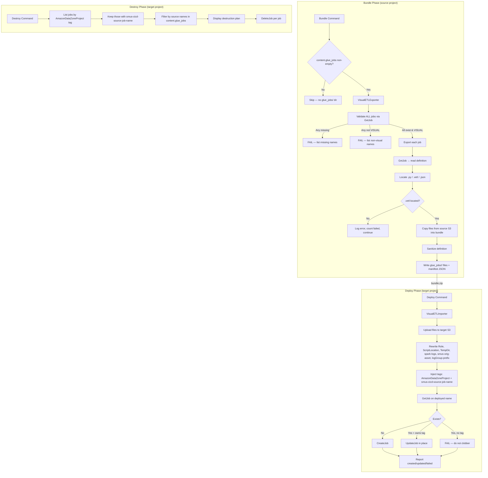

# Design Document: Glue Visual ETL Support

## Overview

### Background: what is a Glue Visual ETL job?

SageMaker Unified Studio lets data engineers build AWS Glue ETL pipelines with a **visual, drag-and-drop editor** instead of writing Spark code by hand. A job built this way is a **Visual ETL job** (`JobMode: VISUAL` in Glue). Under the hood, each Visual ETL job is backed by three files stored in the project's S3 bucket:

- `<job>.py` — the PySpark script Glue generates from the visual graph and actually runs
- `<job>.vetl` — the visual graph definition; this is what lets the Unified Studio UI re-open the job in the drag-and-drop editor
- `<job>.json` — the job's metadata (worker sizing, arguments, connections, etc.)

### The problem this feature solves

Teams build and test a Visual ETL job in a **development** project, then need to promote it to **test** and **production** projects. The SMUS CI/CD CLI has no first-class way to move a Glue job between projects today — a user hand-copies files and hand-writes orchestration. Two things routinely go wrong: forgetting the `.vetl` (the promoted job loses its visual graph), and — most importantly — the promoted job does not appear in the target project's UI at all, because Unified Studio only shows jobs that carry the right project tag.

This feature adds an **end-to-end, declarative way to promote Visual ETL jobs**. A new `content.glue_jobs` manifest section declares which jobs to promote, and the CLI handles the full lifecycle: `bundle` (export), `deploy` (recreate in the target), `destroy` (clean up), and `deploy --dry-run` (validate first).

### What makes a deployed job appear correctly in the Unified Studio UI

This is the crux of the feature. The UI only shows Glue jobs tagged as belonging to a project, and only renders the visual editor when the job points at its `.vetl`. Three elements are required, and the importer injects all three automatically:

| Element | Where it is set | What happens without it |
|---|---|---|
| `AmazonDataZoneProject` tag = target project ID | job `Tags` | Job exists in Glue but is **invisible** in the UI |
| `--smus-orig-asset` = deployed `.vetl` location | `DefaultArguments` | Job appears but **without the visual graph** (looks like a script job) |
| `--custom-logGroup-prefix` = `datazone-<projectId>-<stage>` | `DefaultArguments` | Job appears but **logs are not associated** with the project |

### How the two halves fit together

The `bundle` phase reads a job and produces a portable bundle (files + a small index manifest), scrubbed of every source-account/region/bucket value. The `deploy` phase reads that bundle, uploads the files into the target project's S3, recomputes all target-scoped values, injects the three UI elements plus a source-tracking tag, and creates or updates the job. `destroy` and `dry-run` operate on the same source-tracking tag.

### How it fits the CLI

The design mirrors the existing **catalog import/export** feature (`catalog_export.py` / `catalog_import.py`): two new helper modules plus small hooks in `bundle`, `deploy`, `destroy`, and the dry-run engine. The `glue_job` resource type already exists in the deploy registry; this feature adds it to the destroy registry and implements the deletion path.

### Design Goals

- **UI-first correctness**: guarantee deployed jobs appear in the UI by always injecting the project tag, `--smus-orig-asset`, and `--custom-logGroup-prefix`
- **Portability**: sanitize all source-account/region/bucket values so a bundle from one account can be deployed into another
- **Idempotency & ownership**: re-deploys update the existing job in place, tracked by a source tag; jobs the tool does not own are never overwritten or deleted
- **Resilience**: one job failing does not abort the others; failures are collected and reported
- **Consistency**: follow the module structure, error handling, and reporting patterns of the catalog feature

### Key Design Decisions

1. **Generic section, restricted behavior** — the manifest section is the generic `content.glue_jobs` list, but this iteration only handles `JobMode: VISUAL` jobs and rejects script jobs at validation with a clear "not yet supported" message. Future work adds script jobs without a schema change.
2. **Three-file model** — `.py` from `Command.ScriptLocation`, `.vetl` from `--smus-orig-asset`, `.json` as the script's sibling. A Visual ETL job must have a `.vetl`; if it can't be located, that job fails.
3. **Sanitize at export, rewrite at deploy** — export strips `Role`, `Connections`, `Command.ScriptLocation`, `Tags`, and placeholders the four location-specific arguments; deploy recomputes them for the target. This keeps bundles portable and both sides testable as pure functions.
4. **Tag-based source tracking** — deployed jobs carry `smus-cicd-source-job-name`. Update discovery, destroy filtering, and the ownership guard all key off this tag.
5. **Ownership guard** — if a target job with the computed name exists but lacks the tracking tag, deploy fails that job rather than clobbering a manually created one.
6. **Reuse the `glue_job` resource type** — already in `DEPLOY_RESOURCE_TYPES`; this feature adds it to `DESTROY_SUPPORTED_RESOURCE_TYPES` and implements deletion, satisfying the `TestDeployDestroyDrift` invariant.
7. **Two helper modules** — `visual_etl_export.py` and `visual_etl_import.py`, mirroring `catalog_export.py` / `catalog_import.py`.

---

## Architecture

### High-Level Data Flow



In plain terms: `bundle` confirms every configured job exists and is a Visual ETL job, then copies each job's three files into the bundle and records a small manifest, scrubbing source-specific values. `deploy` uploads those files into the target project, recomputes every target-scoped value, injects the tags and arguments that make the job usable and visible, and creates or updates the job. `destroy` finds only the jobs this tool deployed (by tag) and deletes them.

### Module Placement

```
src/smus_cicd/
├── helpers/
│   ├── visual_etl_export.py        # NEW: export logic for bundle
│   ├── visual_etl_import.py        # NEW: create/update logic for deploy
│   └── ...
├── commands/
│   ├── bundle.py                   # MODIFIED: call exporter when content.glue_jobs set
│   ├── deploy.py                   # MODIFIED: call importer after catalog import
│   ├── destroy_validator.py        # MODIFIED: discover glue jobs by tag
│   ├── destroy_executor.py         # MODIFIED: delete glue jobs
│   ├── destroy_models.py           # MODIFIED: add "glue_job" to DESTROY_SUPPORTED_RESOURCE_TYPES
│   └── dry_run/
│       └── checkers/
│           └── glue_job_checker.py # NEW: dry-run validation for glue jobs
├── application/
│   └── application_manifest.py     # MODIFIED: add GlueJobEntry + content.glue_jobs list
└── resource_types.py               # UNCHANGED: "glue_job" already present
```

### Integration Points

| Command | Integration Point | Action |
|---------|-------------------|--------|
| `bundle` | After catalog export | Call `export_visual_etl_jobs()` if `content.glue_jobs` non-empty |
| `deploy` | After catalog import, before bootstrap | Call `deploy_visual_etl_jobs()` if manifest present and not disabled |
| `destroy` | Validation phase | List by tag → filter by `smus-cicd-source-job-name` → filter by configured source names |
| `destroy` | Execution phase | DeleteJob per filtered job |
| `dry-run` | After catalog checker | `GlueJobChecker.check()` validates prerequisites |

---

## Components and Interfaces

### 1. Manifest Configuration (`application_manifest.py`)

```python
@dataclass
class GlueJobEntry:
    """A single content.glue_jobs entry."""
    name: str                          # required; source Glue job name; pattern [a-zA-Z0-9_-]{1,255}
    source: Optional[str] = None       # optional source stage; defaults to bundle default source
    target_name: Optional[str] = None  # optional; deployed job base name; defaults to `name`
```

Added to `ContentConfig`:

```python
@dataclass
class ContentConfig:
    storage: List[StorageConfig] = field(default_factory=list)
    git: List[GitContentConfig] = field(default_factory=list)
    catalog: Optional[CatalogConfig] = None
    glue_jobs: List[GlueJobEntry] = field(default_factory=list)  # NEW
    quicksight: List[QuickSightDashboardConfig] = field(default_factory=list)
    workflows: List[Dict[str, Any]] = field(default_factory=list)
```

Per-stage deployment configuration:

```python
@dataclass
class DeploymentConfiguration:
    storage: List[StorageConfig] = field(default_factory=list)
    git: List[GitTargetConfig] = field(default_factory=list)
    catalog: Optional[Dict[str, Any]] = None
    glue_jobs: Optional[Dict[str, Any]] = None  # NEW: {disable, target_suffix, overrides}
    quicksight: Optional[Dict[str, Any]] = None
```

Parsing rules: `name` must match `[a-zA-Z0-9_-]{1,255}`; `(name, source)` pairs unique; `target_name` parsed from YAML key `targetName`; absent/empty `glue_jobs` list means neither export nor deploy runs.

### 2. VisualETLExporter (`helpers/visual_etl_export.py`)

```python
def export_visual_etl_jobs(
    domain_id: str,
    region: str,
    entries: List[GlueJobEntry],
    resolve_project_for_stage: Callable[[Optional[str]], Tuple[str, str, str]],
) -> Tuple[List[ExportedVisualEtlJob], Dict[str, Any]]:
    """
    Export Visual ETL (JobMode: VISUAL) jobs configured in content.glue_jobs.

    Validation (fail-fast, before any file copy):
      1. GetJob(name) for each entry against its source stage project.
      2. Fail if any missing (list all) or any not JobMode == VISUAL (list all).
    Export (per validated entry):
      - locate + copy .py / .vetl / .json from source S3
      - sanitize the definition; record sourceStage and targetName

    Returns (exported jobs, export manifest dict). Raises SystemExit on validation failure.
    """
```

Internal: `_validate_entries`, `_locate_artifacts`, `_copy_artifact`, `_sanitize_definition`, `_build_export_manifest` (as in the export design), plus:

```python
@dataclass
class ExportedVisualEtlJob:
    source_job_name: str
    source_stage: str
    target_name: Optional[str]
    job_mode: str                 # always "VISUAL"
    definition: Dict[str, Any]    # sanitized create_job kwargs
    artifacts: Dict[str, str]     # {"script": path, "visual": path, "metadata": path?}
```

### 3. VisualETLImporter (`helpers/visual_etl_import.py`)

```python
def deploy_visual_etl_jobs(
    domain_id: str,
    project_id: str,
    region: str,
    stage_name: str,
    manifest_data: Dict[str, Any],
    artifact_files: Dict[str, bytes],
    s3_uri: str,
    iam_role_arn: str,
    target_suffix: str = "",
    overrides: Optional[Dict[str, Dict[str, Any]]] = None,
) -> GlueJobDeploySummary:
    """
    Deploy Visual ETL jobs into a target project.

    For each job in the manifest:
      Step 1: upload files to {s3Uri}glue_jobs/<deployedName>/
      Step 2: rewrite Role, Command.ScriptLocation, --TempDir, --spark-event-logs-path,
              --smus-orig-asset, --custom-logGroup-prefix
      Step 3: inject Tags AmazonDataZoneProject=project_id, smus-cicd-source-job-name=sourceJobName
      Step 4: GetJob(deployedName) → CreateJob or UpdateJob (ownership-guarded)
    Returns GlueJobDeploySummary(created, updated, failed).
    """
```

Internal functions:

```python
def _validate_export_manifest(manifest_data) -> None:
    """Require metadata{sourceProjectId,sourceDomainId,sourceRegion,exportTimestamp,jobCount}
    and jobs[]. Raise ValueError before any API calls."""

def _upload_artifacts(s3, s3_uri, deployed_name, artifact_files) -> Dict[str, str]:
    """Upload files; return {kind: target_s3_uri}."""

def _deployed_name(job_entry, target_suffix) -> str:
    """(targetName or sourceJobName) + target_suffix."""

def _build_target_kwargs(job_entry, target_uris, s3_uri, iam_role_arn,
                         project_id, stage_name, overrides) -> Dict[str, Any]:
    """Construct create/update kwargs with all target rewrites + tags + overrides."""

def _rewrite_default_arguments(args, s3_uri, project_id, stage_name, visual_uri) -> Dict[str, str]:
    """Rewrite --TempDir, --spark-event-logs-path, --smus-orig-asset, --custom-logGroup-prefix."""

def _resolve_target_job(glue, deployed_name) -> Optional[Dict]:
    """GetJob; return def or None on EntityNotFoundException."""

def _owns_job(job_def, source_job_name) -> bool:
    """True iff smus-cicd-source-job-name tag == source_job_name."""

def _create_or_update(glue, deployed_name, kwargs, existing) -> DeployResult:
    """CreateJob if not existing; UpdateJob if owned; FAIL if exists unowned."""
```

Result/summary models:

```python
class DeployStatus(enum.Enum):
    CREATED = "created"; UPDATED = "updated"; FAILED = "failed"

@dataclass
class DeployResult:
    status: DeployStatus
    source_job_name: str
    deployed_job_name: Optional[str] = None
    message: str = ""

@dataclass
class GlueJobDeploySummary:
    created: int = 0
    updated: int = 0
    failed: int = 0
    @property
    def total(self) -> int: return self.created + self.updated + self.failed
    @property
    def has_failures(self) -> bool: return self.failed > 0
```

### 4. Dry-Run Checker (`commands/dry_run/checkers/glue_job_checker.py`)

```python
class GlueJobChecker:
    """Validates Glue job deployment prerequisites during dry-run."""

    def check(self, context: DryRunContext) -> List[Finding]:
        """
        1. S3 connection (default.s3_shared) exists and bucket reachable (HEAD).
        2. IAM perms via SimulatePrincipalPolicy: glue:GetJob, glue:CreateJob,
           glue:UpdateJob, glue:TagResource, glue:GetTags, s3:PutObject.
        3. Report jobCount from the export manifest.
        4. WARN for any VISUAL job missing a visual artifact.
        """
```

Registered in `engine.py` after the catalog checker; invoked only when the bundle contains `glue_jobs/glue_jobs_export_manifest.json`.

### 5. Destroy Integration

`destroy_models.py`: add `"glue_job"` to `DESTROY_SUPPORTED_RESOURCE_TYPES`.

`destroy_validator.py`:

```python
def _discover_glue_jobs(glue, project_id, configured_source_names) -> List[ResourceToDelete]:
    """List jobs by AmazonDataZoneProject tag → keep those with smus-cicd-source-job-name →
    filter to those whose tag value is in configured_source_names."""
```

`destroy_executor.py`:

```python
def _delete_glue_job(glue, job_name) -> ResourceResult:
    """DeleteJob. EntityNotFoundException → not_found; other → error; continue."""
```

---

## Data Models

### GlueJobsExportManifest (JSON in bundle)

```json
{
  "metadata": {
    "sourceProjectId": "6roqiksku0ljtz",
    "sourceDomainId": "dzd-xxxxxxxx",
    "sourceRegion": "us-east-1",
    "exportTimestamp": "2026-07-21T10:30:00Z",
    "jobCount": 1
  },
  "jobs": [
    {
      "sourceJobName": "test_visual_job",
      "sourceStage": "dev",
      "targetName": "test_visual_job_prod",
      "jobMode": "VISUAL",
      "definition": {
        "JobMode": "VISUAL",
        "GlueVersion": "5.1",
        "WorkerType": "G.1X",
        "NumberOfWorkers": 10,
        "Timeout": 480,
        "MaxRetries": 0,
        "ExecutionClass": "STANDARD",
        "Command": { "Name": "glueetl", "PythonVersion": "3.9" },
        "DefaultArguments": {
          "--enable-glue-datacatalog": "true",
          "--job-language": "python",
          "--enable-auto-scaling": "true",
          "--TempDir": "<TARGET_REWRITE>",
          "--spark-event-logs-path": "<TARGET_REWRITE>",
          "--smus-orig-asset": "<TARGET_REWRITE>",
          "--custom-logGroup-prefix": "<TARGET_REWRITE>"
        }
      },
      "artifacts": {
        "script": "glue_jobs/test_visual_job/test_visual_job.py",
        "visual": "glue_jobs/test_visual_job/test_visual_job.vetl",
        "metadata": "glue_jobs/test_visual_job/test_visual_job.json"
      }
    }
  ]
}
```

### Manifest YAML Configuration

```yaml
content:
  glue_jobs:
  - name: test_visual_job          # source Glue job to promote
    source: dev                    # optional: which stage to export from (default: bundle source)
    targetName: test_visual_job_prod   # optional: deployed job base name (default: name)

stages:
  prod:
    stage: PROD
    domain:
      id: dzd-xxxxxxxx
      region: us-east-1
    project:
      name: projet_analytics_prod
    deployment_configuration:
      glue_jobs:
        disable: false             # optional, default false
        target_suffix: ""          # optional, appended to deployed job name
        overrides:                 # optional per-source-job partial definition
          test_visual_job:
            NumberOfWorkers: 20
            Timeout: 600
```

### Why the definition is sanitized

A definition read from the source project is full of values that only make sense in that account: the IAM `Role` ARN, VPC `Connections`, the S3 `ScriptLocation`, temp/log S3 paths, and source project tags. Copying them verbatim would break a deploy into a different account. So export removes those fields and placeholders the four location-specific arguments; deploy recomputes real target values.

### Validation Rules

- each entry `name` matches `[a-zA-Z0-9_-]{1,255}`; `(name, source)` pairs unique
- absent/empty `glue_jobs` list skips both export and deploy
- a configured job whose `JobMode` is not `VISUAL` fails the bundle (fail-fast)

---

## Correctness Properties

*A property is a characteristic or behavior that should hold true across all valid executions of a system.*

### Property 1: Fail-Fast Validation Completeness

*For any* set of configured entries where at least one is missing (GetJob returns EntityNotFoundException) or non-visual (`JobMode != VISUAL`), the bundle command SHALL validate every entry before any file copy, collect all missing and all non-visual names, fail listing all offenders, and produce zero exported files.

**Validates: Requirements 2.1, 2.2, 2.3**

### Property 2: Manifest Entry Uniqueness and Pattern

*For any* `content.glue_jobs` list, parsing SHALL raise a validation error iff some entry `name` violates `[a-zA-Z0-9_-]{1,255}` or some `(name, source)` pair is duplicated; otherwise parsing SHALL succeed.

**Validates: Requirements 1.2, 1.7, 1.8**

### Property 3: Export Manifest Schema Correctness

*For any* set of exported jobs (including the empty set), the serialized manifest SHALL have exactly two top-level keys (`metadata`, `jobs`); `metadata` SHALL contain `sourceProjectId`, `sourceDomainId`, `sourceRegion`, `exportTimestamp` (ISO 8601), and `jobCount` (equal to the length of `jobs`); each job entry SHALL contain `sourceJobName`, `sourceStage`, `targetName`, `jobMode` (equal to `VISUAL`), `definition`, and `artifacts`.

**Validates: Requirements 4.2, 4.3, 4.4, 4.7**

### Property 4: Definition Sanitization Removes Source Coordinates

*For any* source job definition, the sanitized `definition` SHALL NOT contain a `Role`, `Connections`, `Command.ScriptLocation`, or `Tags` key, any 12-digit AWS account ID, any source S3 bucket name, or any AWS region string in a retained value; and `--TempDir`, `--spark-event-logs-path`, `--custom-logGroup-prefix`, and `--smus-orig-asset` SHALL each equal `<TARGET_REWRITE>`.

**Validates: Requirements 4.5, 4.6, 4.8**

### Property 5: Bundle Internal Consistency

*For any* successful export, every artifact path in the manifest SHALL correspond to a file in the bundle, and every file under `glue_jobs/<name>/` (excluding the manifest) SHALL be referenced by exactly one job entry.

**Validates: Requirements 4.7**

### Property 6: Visual Artifact Requirement

*For any* configured job, the job SHALL appear in the manifest with a `visual` artifact iff its `.vetl` was located and copied; otherwise the job SHALL be counted as failed and absent from `jobs`.

**Validates: Requirements 3.2, 3.4**

### Property 7: Target Kwargs Construction Invariants

*For any* manifest job entry, the constructed create/update kwargs SHALL set `Command.ScriptLocation` to the uploaded script's target URI, `Role` to the target IAM role ARN, `Tags["AmazonDataZoneProject"]` to the target project ID, `Tags["smus-cicd-source-job-name"]` to `sourceJobName`, `DefaultArguments["--custom-logGroup-prefix"]` to `datazone-<targetProjectId>-<stage>`, and `DefaultArguments["--smus-orig-asset"]` to the deployed `.vetl` location.

**Validates: Requirements 6.2, 6.3, 6.4, 6.5**

### Property 8: Ownership Guard

*For any* existing target job, deploy SHALL update it in place iff its `smus-cicd-source-job-name` tag equals the entry's `sourceJobName`; if the tag is absent, deploy SHALL count the job as failed and SHALL NOT call UpdateJob or CreateJob for it.

**Validates: Requirements 7.2, 7.3, 7.4**

### Property 9: Deployed Name and Override Application

*For any* entry and stage config, the deployed job name SHALL equal `(targetName or sourceJobName) + target_suffix`; and for any `overrides` map, definition field values SHALL equal the override where present and the manifest value elsewhere, with overrides referencing unknown names altering no deployed job.

**Validates: Requirements 6.7, 6.11**

### Property 10: Destroy Tag-Based Filtering

*For any* set of target jobs, the destruction plan SHALL include exactly those jobs that carry a `smus-cicd-source-job-name` tag whose value equals the `name` of some `content.glue_jobs` entry; jobs without the tag SHALL never be included.

**Validates: Requirements 9.3, 9.4**

### Property 11: Summary Count Invariant

*For any* deploy processing N jobs, `created + updated + failed` SHALL equal N; *for any* export processing M configured jobs, `exported + failed` SHALL equal M and `metadata.jobCount` SHALL equal `exported`.

**Validates: Requirements 3.5, 6.10**

---

## Error Handling

| Error Source | Behavior | Impact |
|---|---|---|
| GetJob fails for a configured name (EntityNotFoundException) | Collect missing name, continue validating, then fail bundle listing all | Bundle fails (fail-fast) |
| Resolved job is not `JobMode: VISUAL` | Collect non-visual name, continue validating, then fail bundle listing all | Bundle fails (fail-fast) |
| `.vetl` cannot be located/copied (export, single) | Log error with job name, count failed, continue | Export continues |
| File S3 copy failure (export, single) | Log job name + key, count failed, continue | Export continues |
| Missing S3 connection (deploy) | Raise error, skip all glue job deploy | Deploy reports failure |
| File upload failure (deploy, single) | Log job name + key, count failed, skip create/update, continue | Deploy continues |
| CreateJob/UpdateJob error (single) | Log job name + error, count failed, continue | Deploy continues |
| Target job exists without tracking tag | Log warning, count failed, do NOT overwrite | Deploy continues |
| Missing file in bundle (deploy) | Log job name + path, count failed, continue | Deploy continues |
| Missing manifest keys (deploy) | Raise validation error before any API calls | Deploy reports failure |
| ThrottlingException (Glue/S3) | Retry exponential backoff (initial 1s, doubling, max 3 retries) | Transparent retry |
| DeleteJob EntityNotFoundException (destroy) | Record not_found, continue | Destroy continues |
| DeleteJob other error (destroy) | Log name + error, record error, continue | Destroy continues |
| List failure (destroy validation) | Report error, fail validation for that stage | Destroy aborts |

### Exit Code Rules

- **Bundle**: non-zero if any configured job is missing or non-visual (fail-fast), OR any job failed to export
- **Deploy**: non-zero if any job failed to create/update
- **Destroy**: reports counts (deleted, not_found, error); non-zero on unexpected errors

### Throttling Retry Strategy

Glue/S3 API calls are wrapped with a retry decorator identical in behavior to the catalog feature:

```python
def _retry_on_throttle(func, max_retries=3, initial_delay=1.0):
    for attempt in range(max_retries + 1):
        try:
            return func()
        except ClientError as e:
            code = e.response["Error"]["Code"]
            if code in ("ThrottlingException", "ThrottledException") and attempt < max_retries:
                time.sleep(initial_delay * (2 ** attempt) + random.uniform(0, 0.5))
            else:
                raise
```

---

## Testing Strategy

### Property-Based Testing (Hypothesis)

Tested with `hypothesis`, minimum 100 iterations per property, on pure functions decoupled from AWS APIs.

**Test file**: `tests/unit/helpers/test_glue_job_properties.py`

| Property | Function Under Test | Generator Strategy |
|---|---|---|
| P1: Fail-Fast Validation | `_validate_entries()` (mocked GetJob) | Random entry sets with missing/non-visual subsets |
| P2: Entry Uniqueness/Pattern | manifest parsing | Random entries with duplicate/invalid names |
| P3: Manifest Schema | `_build_export_manifest()` | Random ExportedVisualEtlJob lists (0-20) |
| P4: Sanitization | `_sanitize_definition()` | Random defs with account/region/bucket noise + target args |
| P5: Bundle Consistency | End-to-end export (mocked APIs) | Random job sets with files |
| P6: Visual Artifact | Export pipeline (mocked APIs) | Random jobs with/without resolvable `.vetl` |
| P7: Kwargs Construction | `_build_target_kwargs()` | Random entries + target context |
| P8: Ownership Guard | `_create_or_update()` (mocked GetJob) | Random existing jobs with/without tag |
| P9: Name/Override | `_deployed_name()` + `_build_target_kwargs()` | Random suffix + overrides incl. unknown names |
| P10: Destroy Filtering | `_discover_glue_jobs()` (mocked list) | Random jobs + configured name sets |
| P11: Summary Count | export + deploy accumulation | Random success/failure sequences |

Each test uses `@settings(max_examples=100)`. Tag format: `# Feature: glue-visual-etl-support, Property {N}: {description}`.

### Unit Tests (pytest)

**Test files**:
- `tests/unit/helpers/test_visual_etl_export.py`
- `tests/unit/helpers/test_visual_etl_import.py`
- `tests/unit/commands/test_glue_job_dry_run.py`
- `tests/unit/commands/test_glue_job_destroy.py`

**Key scenarios**:
- Manifest parsing: list entries with/without `source`/`targetName`, invalid name → error, duplicate `(name, source)` → error, absent/empty → skip
- Fail-fast: missing name → error lists all missing; `JobMode: SCRIPT` entry → error lists non-visual with "not yet supported"
- Export happy path: locate `.py`/`.vetl`/`.json` → copy → complete manifest entry
- Export missing `.json` sibling → `metadata` artifact omitted, still succeeds
- Export VISUAL missing `.vetl` → counted failed, absent from `jobs`
- Sanitization strips Role/Connections/ScriptLocation/Tags and placeholders the four args
- Deploy create path: no existing target → CreateJob with all rewrites + tags
- Deploy update path: existing target owns tag → UpdateJob in place
- Deploy ownership guard: existing target without tag → failed, no API write
- Deploy overrides: values applied; unknown name warns
- Deployed name: `(targetName or name) + target_suffix`
- Deploy `deployment_configuration.glue_jobs.disable: true` → skip
- Deploy no manifest in bundle → skip silently
- S3 connection missing → raise, skip all
- Destroy: filters by tag, respects configured names, source env → zero deletions
- Destroy: EntityNotFoundException (not_found), other errors (error)
- Dry-run: S3 reachable, IAM perms, jobCount reported, VISUAL-without-vetl warning
- `TestDeployDestroyDrift` still passes with `glue_job` in both registries

### Integration Test / Example

**Example directory**: `examples/analytic-workflow/glue-visual-etl/` (new)

**End-to-end round-trip** (real AWS APIs):
1. Author a Visual ETL job in a source project
2. Bundle with `content.glue_jobs: [{name: <job>, source: dev, targetName: <job>_prod}]`
3. Deploy to a target project → first run creates the job
4. Verify the deployed job carries `AmazonDataZoneProject` and `smus-cicd-source-job-name` tags, `JobMode: VISUAL`, and `--smus-orig-asset` pointing at the target `.vetl`
5. Verify the job appears in the target project's Unified Studio UI (observed step)
6. Deploy again → job updated in place (same name, ownership tag intact)
7. Apply an override (NumberOfWorkers) → verify it takes effect
8. Destroy → only the tagged job is deleted; a manually created job remains
9. Negative: configure a `JobMode: SCRIPT` job → bundle fails listing the non-visual name

### Test Utilities

```python
# tests/unit/helpers/conftest.py additions
@pytest.fixture
def sample_get_job_visual():
    """A GetJob response for a Visual ETL job."""
    return {
        "Job": {
            "Name": "test_visual_job",
            "JobMode": "VISUAL",
            "GlueVersion": "5.1",
            "WorkerType": "G.1X",
            "NumberOfWorkers": 10,
            "Role": "arn:aws:iam::111122223333:role/datazone_usr_role_x",
            "Command": {
                "Name": "glueetl",
                "PythonVersion": "3.9",
                "ScriptLocation": "s3://bkt/dzd-x/proj/shared/jobs/test_visual_job/test_visual_job.py",
            },
            "DefaultArguments": {
                "--job-language": "python",
                "--smus-orig-asset": "jobs/test_visual_job/test_visual_job.vetl",
                "--TempDir": "s3://bkt/dzd-x/proj/sys/glue/temp/",
                "--custom-logGroup-prefix": "datazone-proj-dev",
            },
            "Tags": {"AmazonDataZoneProject": "proj", "AmazonDataZoneUsername": "u@x"},
        }
    }
```
